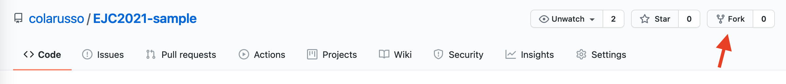
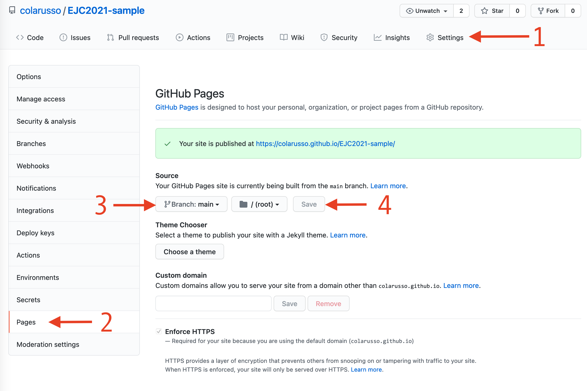

# EJC2021 Sample Site
This repo houses a sample implementation of Spot for folks to fork and play with while atteding the [ABA's 2021 Equal Justice Conference](https://web.cvent.com/event/88833e24-7f13-4193-9d64-e4337310fe01/summary). To create your own copy and customize it for your needs complete the following steps. 

## Create a GitHub Account and Login
If you don't already have a GitHub account, you can [create one here](https://guides.github.com/activities/hello-world/). After you have an account, make sure you are logged in and viewing this page.

## Fork This Repo

Click on the `Fork` button at the top of this page and follow the instructions. 



## Turn on Github Pages

After you finishing forking (copying) this repo, vist the repo. Instead of `colarusso/EJC2021-sample` you will see `[your username]/EJC2021-sample`. That's how you know you're looking at your own copy. Also, you won't see the `your site is published at...` message.

1. Click on `Settings` in the menue at the top of the page.
2. Click on `Pages`in the menue on the side of the page.
3. Choose `main` from the dropdown under `Source`.
4. Clikc `Save`.

After a minute or two you should be able to visit your own webage at something like `https://colarusso.github.io/EJC2021-sample/`, again with `colarusso` replaced by your username. 



## Create a Spot Account

If you don't already have a Spot account, you can [create one here](https://spot.suffolklitlab.org/user/new/). Once you login, navigate to the [Token & Docs page](https://spot.suffolklitlab.org/user/token/) and copy your token into your clipboard. 

## Edit Spot.js file

Now we're going to edit the copy of [js_bin/Spot.js](js_bin/Spot.js) found in your repo. **Be sure you're working with your copy!** You'll know you are because your username will be in the URL. We're going to focus on the first four lines. That is:

```
var man_jur = "LA";
var appBase = "https://afterpattern.com/marketplaces/lagniappe-law-lab?nsmi_codes[]=";
var appCodes = ["FA-00-00-00-00"];
var bearer = "8c93ab722ab46104cdd6e94b0d777760a6ab18a4d6cab9a8afd1581e91946a64";
```
1. Replace `man_ur` with the abbreivation for your jurisdiction (e.g., TX for Texas).
2. Replace `appBase` with the URL for your Afterpattern marketplace. Be sure to keep the `?nsmi_codes[]=` paramter. *Also, if you don't have an Afterpattern marketplace, don't worry, you can come back and edit that later.*
3. Edit the list of [LIST codes]() found in `appCodes`. These are the codes for which your marketplace has apps. So if you have both Family and Housing apps, you would edit your list to look like this `["FA-00-00-00-00","HO-00-00-00-00"]`. If you have more granular apps, you can include those codes too (e.g., `FA-01-00-00-00`).


## Edit index.html

If you want to change the look of your pagge, edit your copy of [index.html](index.html). 
