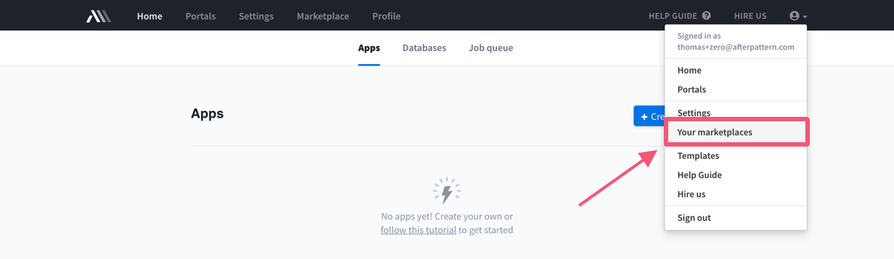
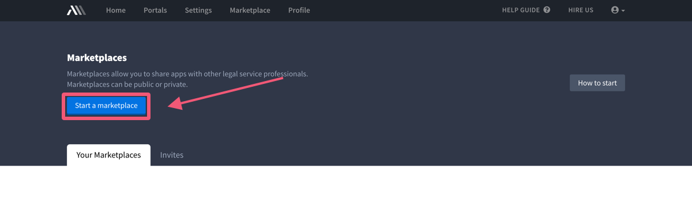
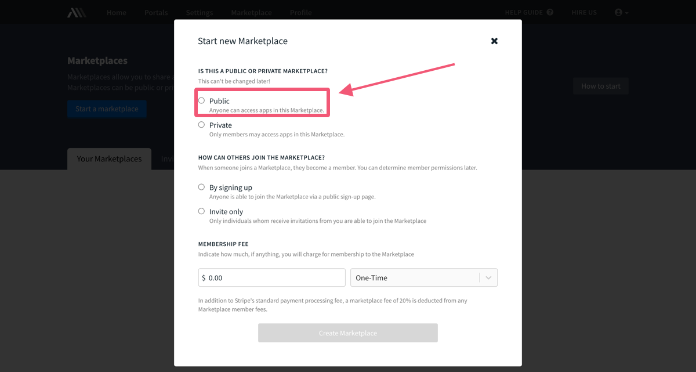
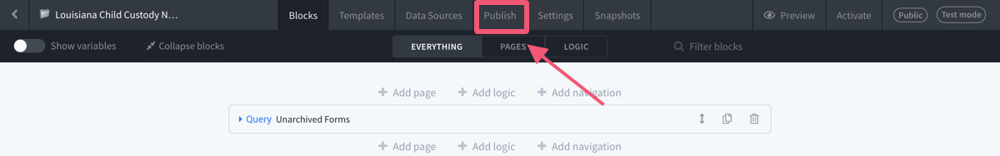
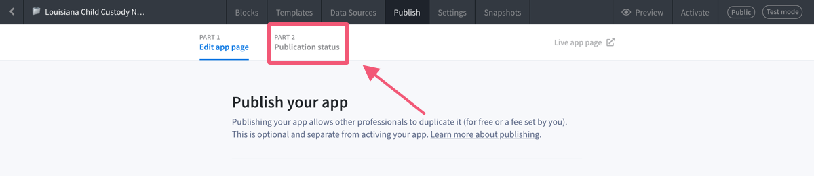
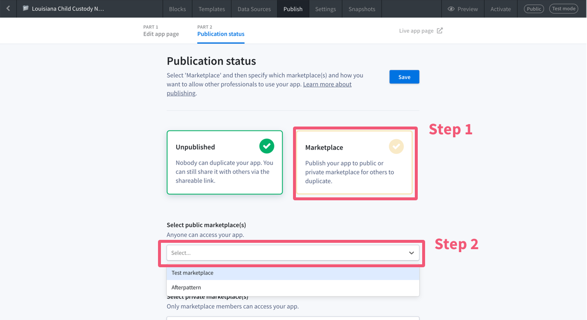
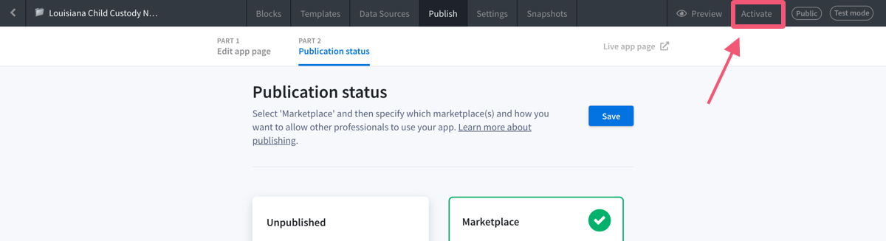
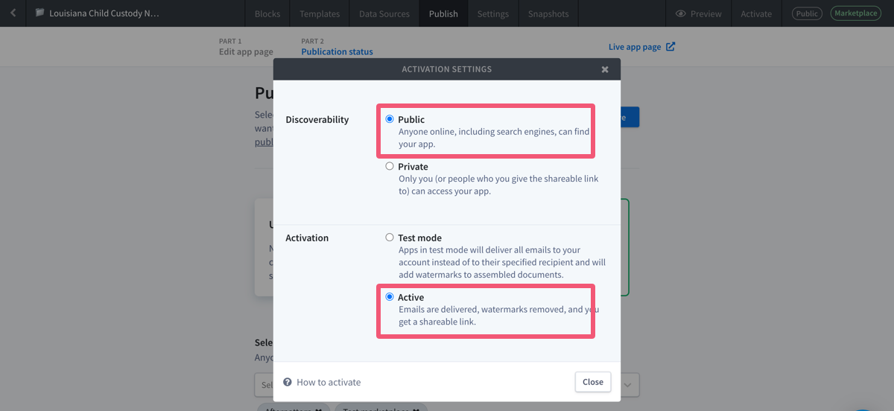
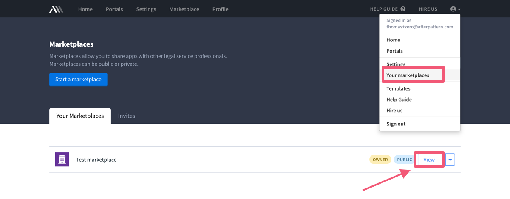
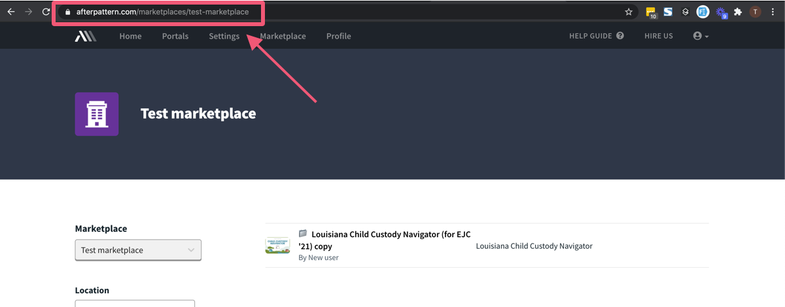

## Set up an Afterpattern marketplace

1. [Create a free Afterpattern account](https://afterpattern.com/users/sign_up).  
2. Under the top-right account menu, click on 'Your marketplaces':

 

3. Start your own marketplace: 

 

4. Give your marketplace a name and designate it as "public" (this is important): 

 

It's up to you whether you want to allow others to join your marketplace by invite only or by signing up (when someone "joins" your marketplace they will be able to publish legal apps to it, and these apps will then show up under your implementation of SPOT).

5. Click 'Create marketplace'.

You now have your own Afterpattern app marketplace 🎉, but it doesn't yet have any apps in it. Amanda Brown, Lagniappe Law Lab executive director, has pre-made apps ready for you to duplicate and add to your marketplace. We will do that now. 

6. Go to the [EJC Legal Apps marketplace](https://afterpattern.com/marketplaces/ejc-legal-apps). 
7. Click on one of the apps.
8. Click 'Create duplicate':

 

You now have a copy of this app in your Afterpattern account. Next, we need to publish the app to your new marketplace. 

9. From your Afterpattern account, click 'Edit' on your new app: 

 

You're now looking at the "code" of the app. Later, if you're interested, check out this [tutorial](https://university.afterpattern.com/tutorial-list/afterpattern-101) to learn the basics of building an Afterpattern app. 

10. Click on the 'Publish' tab:

11. Click 'Part 2: Publication status':

12. Click 'Marketplace' (Step 1) and then select your new marketplace from the dropdown (Step 2): 

13. Hit 'Save'. This establishes how you want to publish your app when you activate it. Activating your app is required to allow others to use it. 

15. Click 'Activate':

15. Select 'public' and 'active':

You now have an Afterpattern marketplace with an app published inside of it! 🎉.

Now we can copy the URL to your Afterpattern marketplace and paste it into your SPOT integration. 

16. Navigate back to 'Your marketplaces' and click 'View' on your marketplace: 

17. Copy the URL from your web browser: 

This is what you will paste into your SPOT implementation. 
